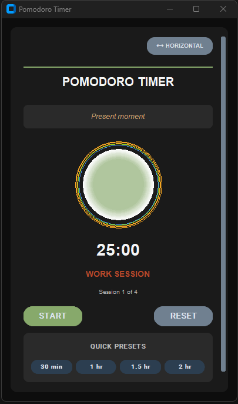
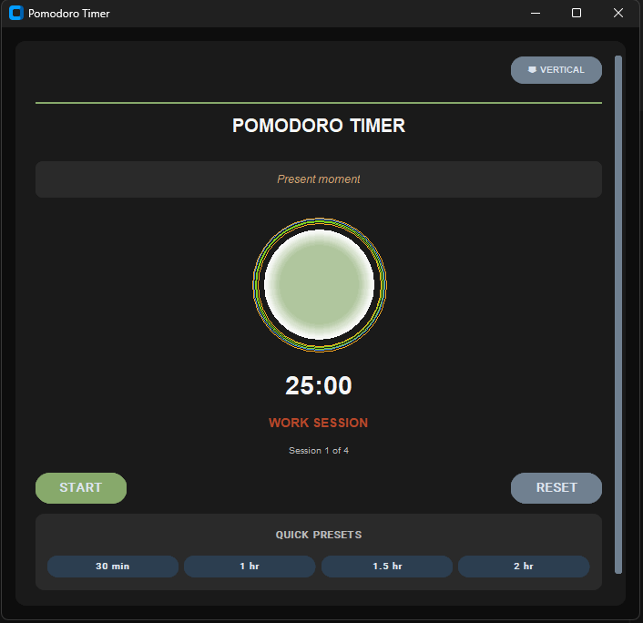

# Pomodoro Timer v2

A modern **Pomodoro Timer** built using `CustomTkinter`, featuring
animations, motivational quotes, a dynamic layout switch
(vertical/horizontal), and sleek UI design inspired by minimal
productivity tools.

------------------------------------------------------------------------

## 🚀 Features

-   🧠 **Pomodoro workflow** --- Focused work and short/long breaks.
-   🎨 **Animated 3D Sphere Halo** --- A glowing, dynamic progress
    visual.
-   💬 **Motivational messages** --- Randomly shown to boost focus.
-   🧭 **Layout toggle** --- Switch between vertical and horizontal
    orientations.
-   ⚙️ **Quick presets** --- Choose 30, 60, 90, or 120-minute timers
    instantly.
-   🌙 **Dark theme UI** --- Built with `customtkinter` and styled in
    modern minimalism.

------------------------------------------------------------------------

## 🧩 Requirements

Install all dependencies with:

``` bash
pip install -r requirements.txt
```

------------------------------------------------------------------------

## 📦 Installation

1.  Clone this repository or download the script.
2.  Make sure you have **Python 3.9+** installed.
3.  Run the app:

``` bash
python pomodoro_v2.py
```

------------------------------------------------------------------------

## 🖼️ Screenshot

Here's a demo screenshot of the final UI

|  |  |
|:-----------------------------:|:-----------------------------:|
| Horizontal Image              | Vertical                      |

------------------------------------------------------------------------

## 🖥️ Controls

| Action             |    Description                              |
|:------------------:|:-------------------------------------------:|
| **Start**          | Starts the Pomodoro timer                   |
| **Pause/Resume**   | Pauses or resumes the current session       |
| **Reset**          | Stops and resets the timer                  |
| **Quick Presets**  | Sets predefined timer durations             |
| **Layout Toggle**  | Switch between vertical/horizontal layouts  |

## 🌈 Code Overview

-   **customtkinter** → Modern dark UI widgets
-   **threading** → Keeps timer responsive
-   **Canvas** → Animations for halo sphere
-   **tkinter.messagebox** → Session notifications
-   **random** → Motivational quote selector

------------------------------------------------------------------------

## 💡 File Structure

    📁 Pomodoro Timer
    │
    ├── pomodoro_v2.py        # Main application
    ├── requirements.txt      # Dependencies
    └── README.md             # Documentation
    └── assets/              # Screenshot

------------------------------------------------------------------------

## ⚠️ Notes

-   Avoid closing the app while a timer thread is running.
-   Recommended window size: `400x550` (vertical) or `700x400`
    (horizontal).

------------------------------------------------------------------------

## 🧠 Future Improvements

- Add Spotify embedding
- Add notification system
- Unique UI look with a cyberpunk theme?!?
- Better animations, futuristic UI
- Improve button feel & placement.
- UI changes significantly when switching from horizontal & vertical mode
